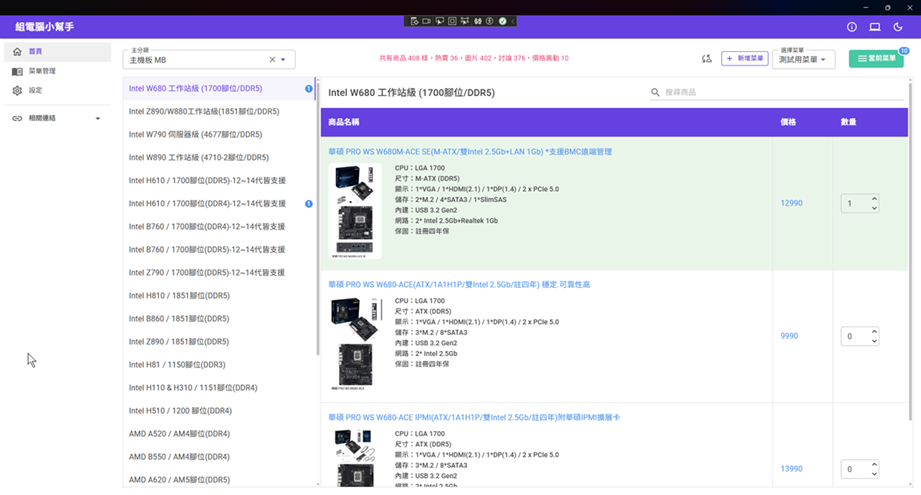
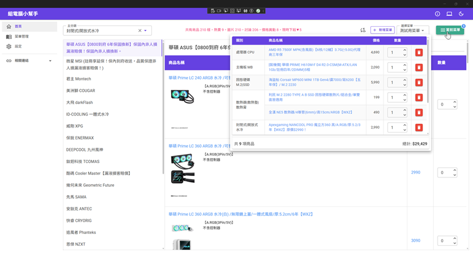
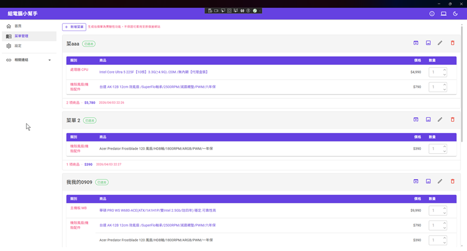

# PCCustomizer(組電腦小幫手)

因緣際會換了一份寫C#後端的工作，由於沒開發過桌面APP，想要來寫一個試試看，偶然發現微軟有再推`blazor hybrid`，因此就來學習了
然後順便做一個小專案，證明自己的學習成果。感覺現在很多東西用網頁就能夠做到，沒必要用桌面 APP，
因此想了很久，感覺也只有看自己電腦資訊會比較需要用到而已，所以就決定做這個

## 程式截圖

## 安裝說明

由於這是一個獨立發布的應用程式 (未上架到 Microsoft Store)，在安裝前，您**必須先手動信任開發者的憑證**，Windows 系統才會允許安裝。

**重要：** 憑證只需要安裝**一次**。未來更新版本時，只需下載新的 `.msix` 檔案執行即可。

### 步驟一：安裝安全憑證 (只需執行一次)

此步驟是為了告訴 Windows「我信任這個應用程式的來源」。

1. 下載 `PCCustomizer_x64.cer` 檔案。
2. 在 `.cer` 檔案上按**右鍵**，選擇「**安裝憑證**」(Install Certificate)。
3. 開啟「憑證匯入精靈」後，存放位置請務必選擇「**本機電腦**」(Local Machine)，然後按「下一步」。
4. (此時系統會跳出使用者帳戶控制 (UAC) 視窗，要求管理員權限，請按「**是**」。)
5. 接著，選擇「**將所有憑證放入以下的存放區**」(Place all certificates in the following store)。
6. 點選「**瀏覽...**」。
7. 從清單中選擇「**受信任的人**」(Trusted People)，然後按「確定」。
8. 按「下一步」，然後按「完成」。
9. 您會看到「匯入成功」的訊息。憑證安裝完畢！

### 步驟二：安裝應用程式

當憑證安裝成功後，您就可以像安裝一般程式一樣安裝主程式了。

1. 下載 `PCCustomizer_x64.msix` 檔案。
2. 直接**點兩下** `.msix` 檔案。
3. 此時會彈出安裝視窗，因為您已信任憑證，發行者 (Publisher) 欄位現在應會正確顯示 (而不是「不明的發行者」)。
4. 按下「**安裝**」(Install) 按鈕。
5. 程式將會自動安裝完成並啟動。

## 技術棧

| 技術               | 版本   | 用途                  |
| ---------------- | ---- | ------------------- |
| .NET MAUI        | 10.0 | 跨平台框架（主要支援 Windows） |
| Blazor Hybrid    | -    | UI 渲染引擎             |
| MudBlazor        | 9.0  | UI 元件庫              |
| EF Core + SQLite | 10.0 | 本地資料持久化             |
| System.Text.Json | 內建   | JSON 解析             |

## 功能

### 原價屋商品資訊

從原價屋 JSON 資料來源擷取商品資訊並存入本地資料庫。首次使用或需要更新時，點擊「**更新原價屋資料**」按鈕手動同步，資料不保證涵蓋所有商品，一切以原價屋官網為準。

### 菜單管理

自由新建菜單、調整商品數量與名稱、一鍵送出原價屋估價單（實驗性功能）。

### 電腦資訊

顯示 CPU、RAM、顯示卡、主機板等硬體資訊（透過 WMI 查詢，僅支援 Windows）。做不到像是 CPU-Z 那麼詳細，但有盡可能顯示了。

## 未來展望

其實一開始我是看到這個[原價屋MCP工具](https://github.com/shyuan/coolpc-mcp-server)，就靈感爆炸。
我最初是希望可以做到用這個MCP+AI，讓它會自動讀取你的電腦硬體資訊，然後根據原價屋的商品給你建議的菜單，
後來MCP+AI我弄不好，就放棄了，總而言之就現在的我是做不到了，也許未來會有人可以做出類似的產品。

~~後來龍蝦出現以後好像就可以取代我當初的想法了~~

## TODO

- 首頁
  - [ ] 左側的菜單增加顯示商品數量
- 菜單管理
  - [ ] 菜單拖曳調整順序（也許未來MudBlazor會修復）

## 特別感謝

- [原價屋MCP工具](https://github.com/shyuan/coolpc-mcp-server)：給了靈感和爬取原價屋資料的思路

## 其他

感覺自己對C#還是沒有很熟悉，寫起來綁手綁腳的，還需要再精進。
之前開發 React Native，就覺得檔案很大，想說微軟的這個會不會小一點，解壓縮完好像也有 100 多MB，我明明就沒有寫什麼東西，
看來跟網頁有關的東西體積都一定不會太小...

雖然是官方推薦的技術，但我遇到很多問題：

- 熱重載有時候會失靈，要去把 bin 和 obj 刪掉再重建
- 有時候緩存還是什麼的，razor 頁面也必須要關掉重開才會正常
- MudBlazor 的拖曳功能不給用，我看[這個問題](https://github.com/MudBlazor/MudBlazor/issues/8227)去年年底就有了，到現在都還沒解決
- 發佈有設定自動更新但不會產生 .appinstaller 的檔案，感覺也是千年遺毒了
